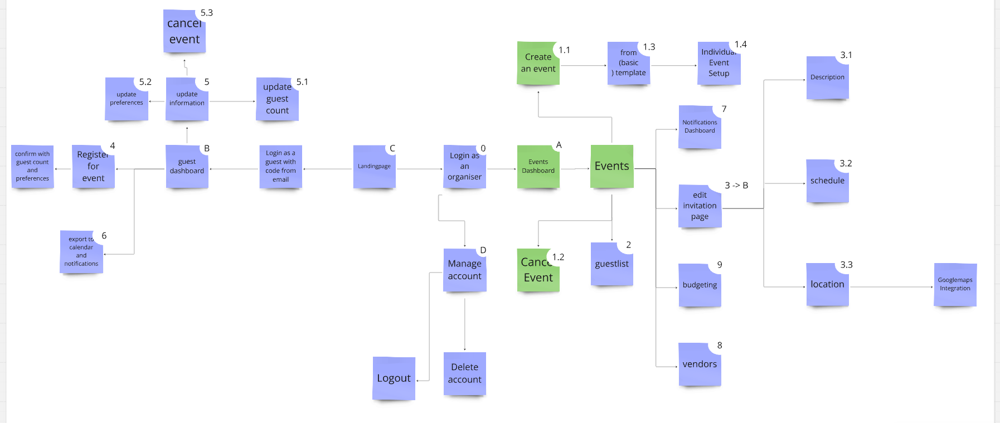

# Eventara frontend

Welcome to the Events Management System Frontend This project provides a robust platform for creating, organizing, and managing events all in one place. From handling guest lists, invitations and RSVPs to managing vendors and budgets, this project providesa seamless event planning experience.

[Check out the Backend Repo](https://github.com/amjadkouayed/event-ms-backend)  

[Our miro planning board](https://miro.com/welcomeonboard/R2VQbkNsNHdVOFBTY2J6ZTBBVnVicmg3S2MxOWJNdWtxV2V0bUN3dFZ3bCtVc3V3ZjltdVVMQ2c5MWNuRTZZeTdZNzI2QWpkbXljRDJveWpCRGloUFNpbU9WaEpXc0ZJbDVrUkhSaTRZcFVUeVR3czFFdkpnWStITjNZTzVJVmUhZQ==?share_link_id=803532159551)


## Features



- **Event Management**: create, update, delete and organize all of your events in one place
- **Guest Management**: Maintain a comprehensive guest list and send invitations effortlessly.
- **RSVP Functionality**: Create custom invitation pages, receive guest confirmations or cancellations, and track their preferences.
- **Notification System**: Stay informed with guest updates and send notifications about event changes.
- **Vendor Management**: Manage vendor details and contacts linked to specific events
- **Budgeting Managment**: Manage budgeting for the event


## Installation

To run this project locally, follow these steps:

1. Clone the repository:

    ```bash
    git clone https://github.com/amjadkouayed/event-ms-frontend.git
    ```

2. Navigate to the project directory:

    ```bash
    cd event-ms-frontend
    ```

3. Install dependencies:

    ```bash
    npm install
    ```

4. Start the development server:

    ```bash
    npm start
    ```

5. Open [http://localhost:3000](http://localhost:3000) in your browser to see the project in action.

